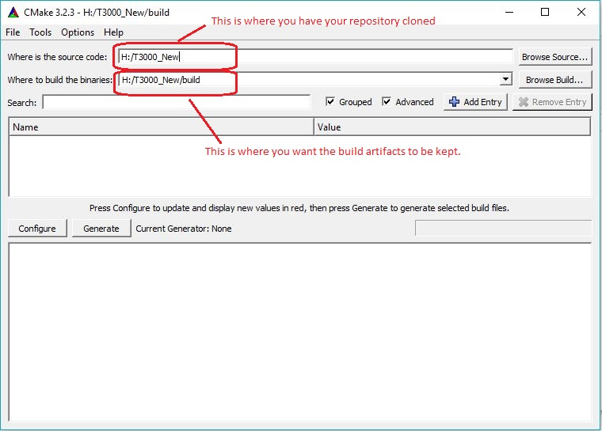
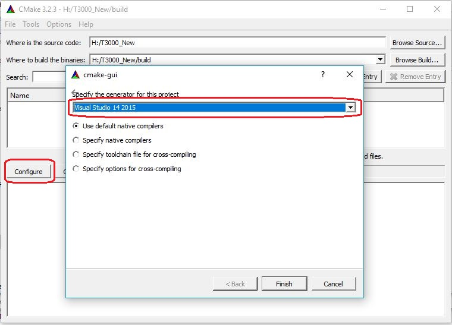
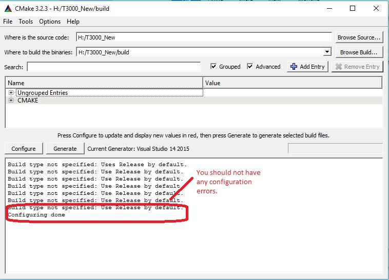
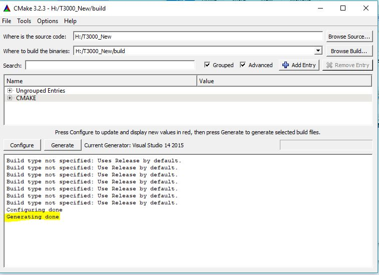
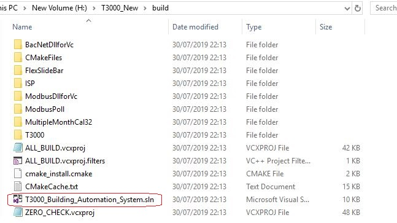

How to build using CMake GUI
============================
If you are not comfortable using a command line, CMake also provides a GUI to acheive the same result. Here is a step by step guide.

1. Execute cmake-gui.exe from the bin directory of CMake. You should get a graphical user interface similar to:

 Make the edits as required and you are ready to begin your adventure with CMake. :)
2. Press configure. You should get a new pop-up where CMake will ask you to select your compiler. Our main development environment is Visual Studio 2015. If you choose to use it then:

 Once you press finish you are ready to configure your project.
3. Once the configuration is done, make sure you don't have errors. 

4. The next step is where you generate the build related artifacts. Since you are using Visual Studio, we should be getting project files for all our components and a solution file to tie them all together.

 You should not be having any erros in this stage too. Once this is done, you will get:

 From this point on, you can start the Visual Studio solution and work in the familier IDE.